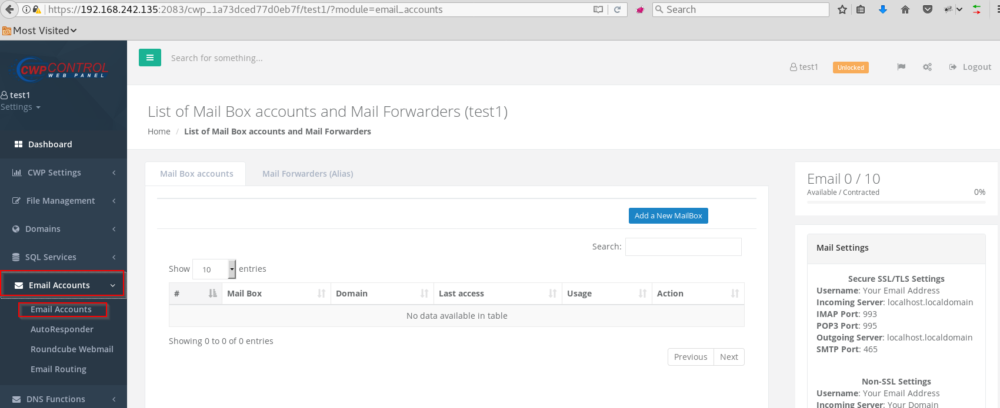
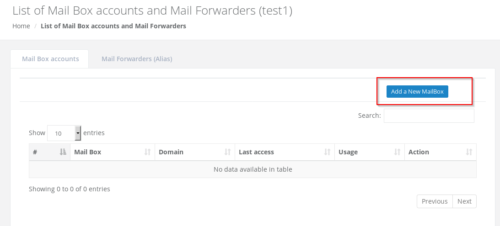
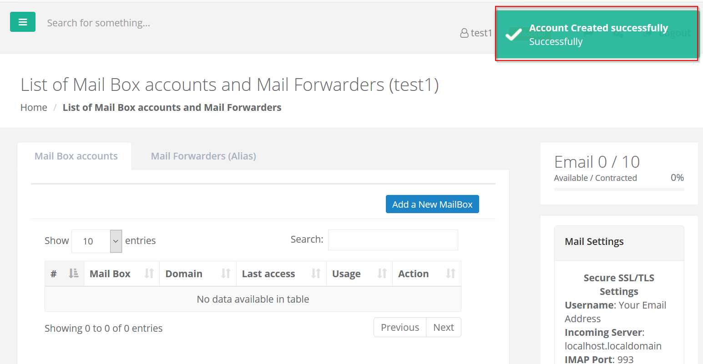
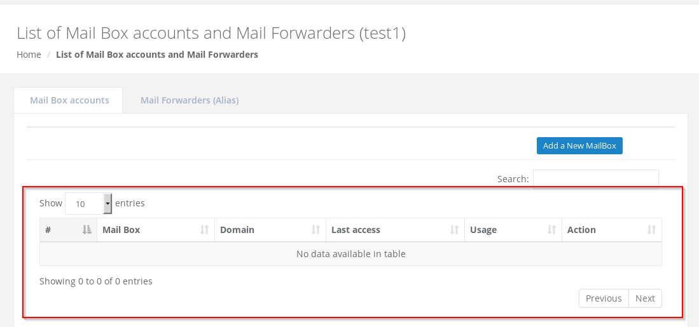
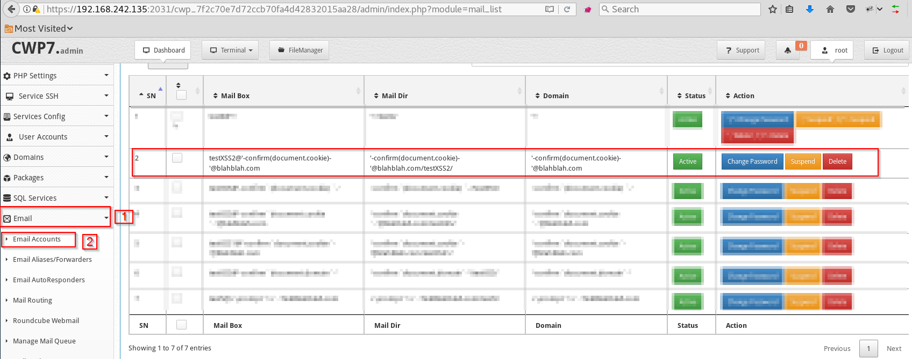
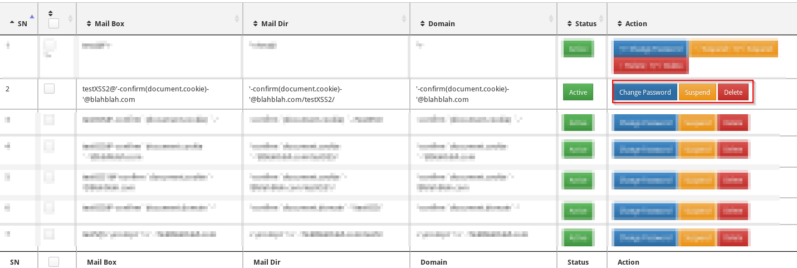
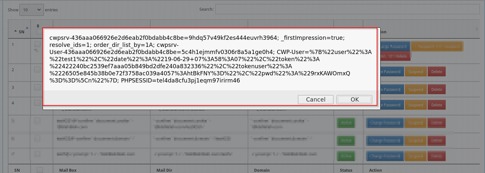

# Information
```
Product             : CWP Control Web Panel
Vulnerability Name  : Cross Site Scripting
version             : 0.9.8.837
Fixed on            : 0.9.8.851
Test on             : CentOS 7.6.1810 (Core)
Reference           : http://centos-webpanel.com/
                    : https://control-webpanel.com/changelog
CVE-Number          : CVE-2019-13476
```
<br>

# Description

User add "New Mail box" with payload XSS without validation

<br>

# Reproduce

1. In user panel and browse to https://192.168.242.135:2083/cwp_1a73dced77d0eb7f/test1/?module=email_accounts or Click at Email Accounts under the Email Accounts and click it again like image below 

<kbd></kbd>

<br>

2. Click "Add a New MailBox" 

<kbd></kbd>

<br>

3. Fill the information

<kbd></kbd>

<br>

4. Use BurpSuite for Intercept request then modified parameter "domain" to payloads XSS

<kbd></kbd>

<br>

5. We can added email success the parameter "domain" without input validate

<kbd></kbd>

<br>

6. In the List of mailbox user it's not exist after add email with xss payload, but in the admin panel added success

<kbd></kbd>

<kbd></kbd>

<br>

7. Let's see in the panel admin Click Email --> Email Accounts we can see the xss payload

<kbd></kbd>

<br>

8. Click any the button such as Change Password, Suspend, Delete XSS payload will be Executed

<kbd></kbd>

<br>

9. In this example I'll tried to Click Change Password,  XSS will be executed 

<kbd>!</kbd>

<br><br>

# Timeline
```
2019-06-05: Discovered the bug
2019-06-05: Reported to vendor
2019-06-05: Vender accepted the vulnerability
2019-07-17: The vulnerability has been fixed
2019-08-20: Advisory published
```

<br>

# Discovered by
```
Pongtorn Angsuchotmetee
Nissana Sirijirakal 
Narin Boonwasanarak
```
